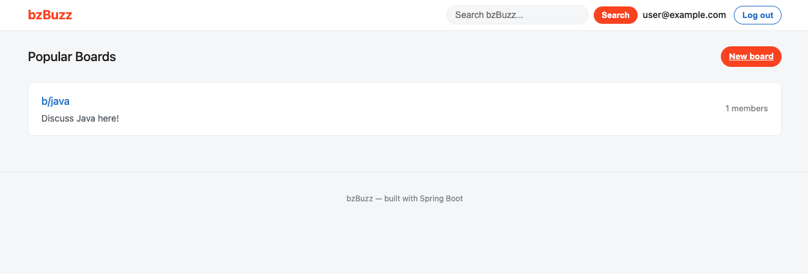
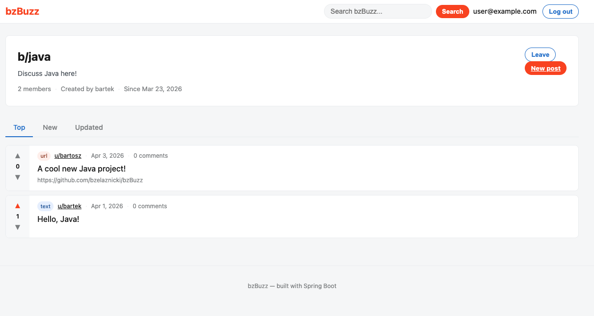
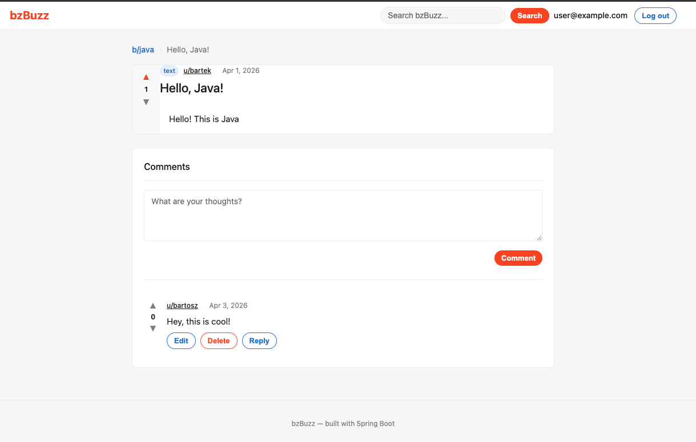
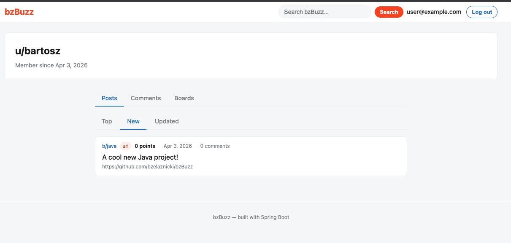
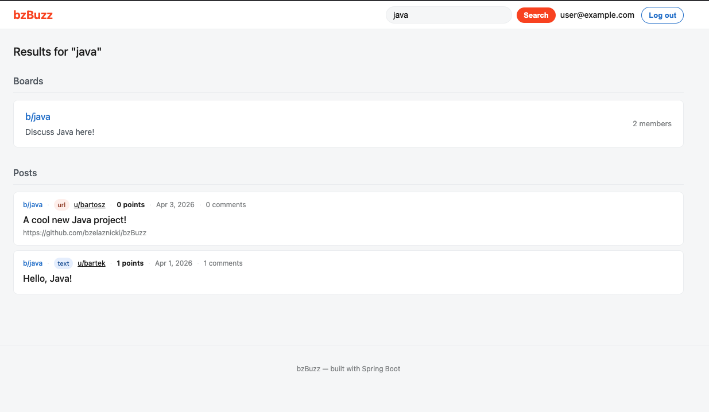

# bzBuzz

A Reddit-style community platform built with Java and Spring Boot.

**[Live Demo](https://buzz.onbz.online)**



## Features

- **Boards** — create and join topic-based communities, with public and private board support
- **Posts** — text and URL post types with slug-based URLs and soft delete
- **Comments** — nested comment threads with replies
- **Voting** — async upvote/downvote on posts and comments with real-time score updates
- **User profiles** — view a user's posts, comments and board memberships
- **Search** — find boards and posts by keyword
- **Pagination and sorting** — browse posts by New, Top or Updated
- **Authentication** — session-based register and login with BCrypt password hashing
- **Role-based access** — board moderators and members with distinct permissions
- **Error handling** — custom 404/500 error pages

## Tech Stack

| Layer | Technology |
|---|---|
| Language | Java 21 |
| Framework | Spring Boot 3.5.11 |
| Security | Spring Security (session-based auth) |
| Persistence | Spring Data JPA + Hibernate |
| Database | PostgreSQL |
| Migrations | Flyway |
| Templating | Thymeleaf + Layout Dialect |
| Build | Maven |
| Deployment | Railway |

## Architecture Decisions

**Pessimistic locking on votes** — concurrent vote operations acquire a `SELECT ... FOR UPDATE` lock on the target post or comment row before updating the score, preventing race conditions where two users voting simultaneously could both pass the moderator-count check or corrupt the score.

**Denormalized vote scores** — `vote_score` is stored directly on `posts` and `comments` rather than calculated from the `votes` table on every read. Updated atomically via `@Modifying` queries when votes are cast.

**Soft deletes** — posts and comments are never hard deleted. Setting `status = DISABLED` preserves data integrity and mirrors Reddit's behaviour where deleted content shows as `[deleted]` while replies remain intact.

**Async voting** — vote buttons fire a `fetch` POST to a REST endpoint (`/api/b/.../vote`) and update the score in place without a full-page reload, while non-JS fallback forms are not provided (requires JS).

**Slug-based post URLs** — post URLs use a normalized title slug with a random 6-character suffix (e.g. `/b/java/posts/my-post-a1b2c3`) rather than UUIDs, making them human-readable and shareable.

**Package-by-feature** — code is organized by domain (`board`, `post`, `comment`, `user`, `search`) rather than by layer, keeping related classes together and making the codebase easier to navigate.

## Screenshots

| Page | Screenshot |
|---|---|
| Homepage |  |
| Board page |  |
| Post view |  |
| Profile page |  |
| Search |  |

## Running Locally

### Prerequisites

- Java 21
- Maven
- Docker (for local Postgres)

### Setup

**1. Clone the repo:**
```bash
git clone https://github.com/bzelaznicki/bzBuzz.git
cd bzBuzz
```

**2. Start Postgres:**
```bash
docker run --name bzbuzz-db \
  -e POSTGRES_PASSWORD=postgres \
  -e POSTGRES_DB=bzbuzz \
  -p 5432:5432 \
  -d postgres:16
```

**3. Configure local settings:**

Create `src/main/resources/application-local.yml`:
```yaml
spring:
  datasource:
    url: jdbc:postgresql://localhost:5432/bzbuzz
    username: postgres
    password: postgres
  jpa:
    show-sql: true
```

**4. Run the app:**

In IntelliJ, set the active profile to `local` in the run configuration, then run `BzbuzzApplication`.

Or via Maven:
```bash
./mvnw spring-boot:run -Dspring-boot.run.profiles=local
```

**5. Open in browser:**
```text
http://localhost:8080
```

Flyway will run all migrations automatically on startup.

## What's Next

- REST API layer for React frontend migration
- Moderator actions (remove posts/comments from boards)
- Board invites
- Email verification on registration
- Password reset flow
- Full-text search with Postgres `tsvector`

## Author

Bartosz Żelażnicki — [GitHub](https://github.com/bzelaznicki)
